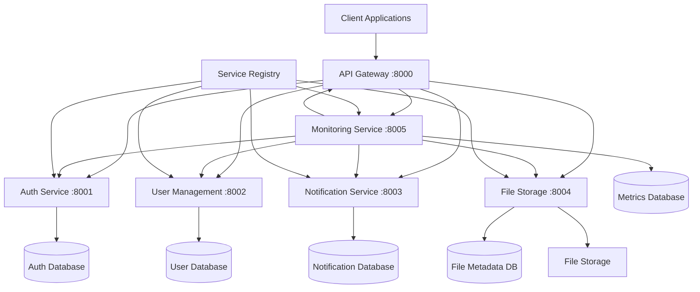

# Design Document

## Overview

Este diseño implementa los 6 servicios básicos fundamentales que debe incluir el FastAPI Microservices SDK. Cada servicio será completamente funcional, independiente, y servirá como ejemplo y punto de partida para arquitecturas de microservicios reales.

## Architecture

### Service Architecture Overview



### Port Allocation Strategy

- **8000**: API Gateway (Entry point)
- **8001**: Authentication Service
- **8002**: User Management Service
- **8003**: Notification Service
- **8004**: File Storage Service
- **8005**: Logging & Monitoring Service

### Database Strategy

Cada servicio tendrá su propia base de datos para mantener independencia:
- **SQLite** para desarrollo local
- **PostgreSQL** para producción
- **Redis** para caching y sessions

## Components and Interfaces

### 1. API Gateway Service (Port 8000)

**Responsibilities:**
- Route requests to appropriate services
- JWT token validation
- Rate limiting
- Circuit breaker implementation
- Request/response logging

**Key Components:**
```python
class APIGateway:
    - router: FastAPI router
    - auth_middleware: JWT validation
    - rate_limiter: Request throttling
    - circuit_breaker: Fault tolerance
    - service_registry: Service discovery
```

**Endpoints:**
- `GET /health` - Gateway health check
- `POST /auth/*` - Proxy to auth service
- `GET /users/*` - Proxy to user service
- `POST /notifications/*` - Proxy to notification service
- `POST /files/*` - Proxy to file service
- `GET /metrics/*` - Proxy to monitoring service

### 2. Authentication Service (Port 8001)

**Responsibilities:**
- User authentication and authorization
- JWT token generation and validation
- Password hashing and verification
- Refresh token management

**Key Components:**
```python
class AuthService:
    - jwt_manager: Token operations
    - password_hasher: Secure password handling
    - user_validator: Credential validation
    - token_blacklist: Revoked tokens
```

**Endpoints:**
- `POST /register` - User registration
- `POST /login` - User authentication
- `POST /logout` - Token invalidation
- `POST /refresh` - Token refresh
- `GET /validate` - Token validation
- `GET /me` - Current user info

### 3. User Management Service (Port 8002)

**Responsibilities:**
- User profile management
- Role and permission assignment
- User CRUD operations
- User search and filtering

**Key Components:**
```python
class UserService:
    - user_repository: Data access layer
    - role_manager: Role assignment
    - permission_checker: Authorization
    - profile_validator: Data validation
```

**Endpoints:**
- `GET /users` - List users with pagination
- `POST /users` - Create new user
- `GET /users/{id}` - Get user by ID
- `PUT /users/{id}` - Update user
- `DELETE /users/{id}` - Delete user
- `POST /users/{id}/roles` - Assign roles
- `GET /users/search` - Search users

### 4. Notification Service (Port 8003)

**Responsibilities:**
- Multi-channel notifications (email, SMS, push)
- Template management
- Scheduled notifications
- Delivery tracking

**Key Components:**
```python
class NotificationService:
    - email_sender: Email delivery
    - sms_sender: SMS delivery
    - push_sender: Push notifications
    - template_engine: Message templating
    - scheduler: Delayed delivery
    - delivery_tracker: Status tracking
```

**Endpoints:**
- `POST /send` - Send immediate notification
- `POST /schedule` - Schedule notification
- `GET /templates` - List templates
- `POST /templates` - Create template
- `GET /status/{id}` - Check delivery status
- `GET /history` - Notification history

### 5. File Storage Service (Port 8004)

**Responsibilities:**
- File upload and download
- File metadata management
- Access control and permissions
- Storage backend abstraction (local/S3)

**Key Components:**
```python
class FileStorageService:
    - storage_backend: File storage abstraction
    - metadata_manager: File information
    - access_controller: Permission checking
    - virus_scanner: Security scanning
    - thumbnail_generator: Image processing
```

**Endpoints:**
- `POST /upload` - Upload file
- `GET /download/{id}` - Download file
- `GET /files` - List files
- `GET /files/{id}` - Get file metadata
- `DELETE /files/{id}` - Delete file
- `POST /files/{id}/share` - Generate share link
- `GET /thumbnails/{id}` - Get thumbnail

### 6. Logging & Monitoring Service (Port 8005)

**Responsibilities:**
- Centralized logging
- Metrics collection
- Health monitoring
- Alert generation

**Key Components:**
```python
class MonitoringService:
    - log_collector: Centralized logging
    - metrics_collector: Performance metrics
    - health_checker: Service monitoring
    - alert_manager: Notification system
    - dashboard_api: Metrics API
```

**Endpoints:**
- `POST /logs` - Receive logs
- `GET /metrics` - Prometheus metrics
- `GET /health/services` - Service health status
- `POST /alerts` - Create alert
- `GET /dashboard/data` - Dashboard metrics

## Data Models

### Authentication Service Models

```python
class User(BaseModel):
    id: UUID
    username: str
    email: str
    password_hash: str
    is_active: bool
    created_at: datetime
    last_login: Optional[datetime]

class Token(BaseModel):
    access_token: str
    refresh_token: str
    token_type: str = "bearer"
    expires_in: int
```

### User Management Models

```python
class UserProfile(BaseModel):
    id: UUID
    user_id: UUID
    first_name: str
    last_name: str
    phone: Optional[str]
    avatar_url: Optional[str]
    roles: List[str]
    permissions: List[str]
    metadata: Dict[str, Any]

class Role(BaseModel):
    id: UUID
    name: str
    description: str
    permissions: List[str]
```

### Notification Models

```python
class Notification(BaseModel):
    id: UUID
    recipient: str
    channel: str  # email, sms, push
    template_id: Optional[UUID]
    subject: str
    content: str
    status: str  # pending, sent, failed
    scheduled_at: Optional[datetime]
    sent_at: Optional[datetime]

class NotificationTemplate(BaseModel):
    id: UUID
    name: str
    channel: str
    subject_template: str
    content_template: str
    variables: List[str]
```

### File Storage Models

```python
class FileMetadata(BaseModel):
    id: UUID
    filename: str
    original_filename: str
    content_type: str
    size: int
    storage_path: str
    owner_id: UUID
    is_public: bool
    created_at: datetime
    tags: List[str]

class FilePermission(BaseModel):
    file_id: UUID
    user_id: UUID
    permission: str  # read, write, delete
```

### Monitoring Models

```python
class LogEntry(BaseModel):
    id: UUID
    service: str
    level: str
    message: str
    timestamp: datetime
    metadata: Dict[str, Any]
    trace_id: Optional[str]

class ServiceHealth(BaseModel):
    service: str
    status: str  # healthy, unhealthy, unknown
    last_check: datetime
    response_time: float
    error_count: int
```

## Error Handling

### Standardized Error Response

```python
class ErrorResponse(BaseModel):
    error: str
    message: str
    details: Optional[Dict[str, Any]]
    timestamp: datetime
    trace_id: str
```

### Error Categories

1. **Authentication Errors (401)**
   - Invalid credentials
   - Expired tokens
   - Missing authentication

2. **Authorization Errors (403)**
   - Insufficient permissions
   - Resource access denied

3. **Validation Errors (422)**
   - Invalid input data
   - Schema validation failures

4. **Service Errors (500)**
   - Database connection failures
   - External service unavailable
   - Internal processing errors

## Testing Strategy

### Unit Testing
- Each service component tested independently
- Mock external dependencies
- Test coverage > 90%

### Integration Testing
- Service-to-service communication
- Database operations
- Authentication flows

### End-to-End Testing
- Complete user workflows
- Multi-service scenarios
- Performance benchmarks

### Load Testing
- Concurrent user simulation
- Service scalability testing
- Resource usage monitoring

## Security Considerations

### Authentication & Authorization
- JWT tokens with short expiration
- Refresh token rotation
- Role-based access control
- API key authentication for service-to-service

### Data Protection
- Password hashing with bcrypt
- Sensitive data encryption at rest
- HTTPS enforcement
- Input validation and sanitization

### Service Communication
- mTLS for inter-service communication
- API rate limiting
- Request/response logging
- Circuit breaker patterns

## Deployment Strategy

### Development Environment
```yaml
# docker-compose.dev.yml
version: '3.8'
services:
  api-gateway:
    build: ./services/api-gateway
    ports: ["8000:8000"]
  
  auth-service:
    build: ./services/auth-service
    ports: ["8001:8001"]
  
  user-service:
    build: ./services/user-service
    ports: ["8002:8002"]
  
  # ... other services
```

### Production Environment
- Kubernetes manifests for each service
- Horizontal Pod Autoscaling
- Service mesh (Istio) for advanced networking
- Persistent volumes for databases

## Monitoring and Observability

### Metrics Collection
- Prometheus metrics for each service
- Custom business metrics
- Resource utilization tracking

### Logging Strategy
- Structured JSON logging
- Centralized log aggregation
- Log correlation with trace IDs

### Distributed Tracing
- OpenTelemetry integration
- Jaeger for trace visualization
- Request flow tracking across services

## Performance Requirements

### Response Time Targets
- API Gateway: < 50ms
- Authentication: < 100ms
- User Management: < 200ms
- Notifications: < 500ms (async)
- File Storage: < 1s (depending on file size)
- Monitoring: < 100ms

### Throughput Targets
- API Gateway: 10,000 req/s
- Authentication: 5,000 req/s
- User Management: 3,000 req/s
- File Storage: 1,000 uploads/s
- Monitoring: 50,000 log entries/s

### Resource Limits
- Memory: 512MB per service (development)
- CPU: 1 core per service (development)
- Storage: 10GB per service database