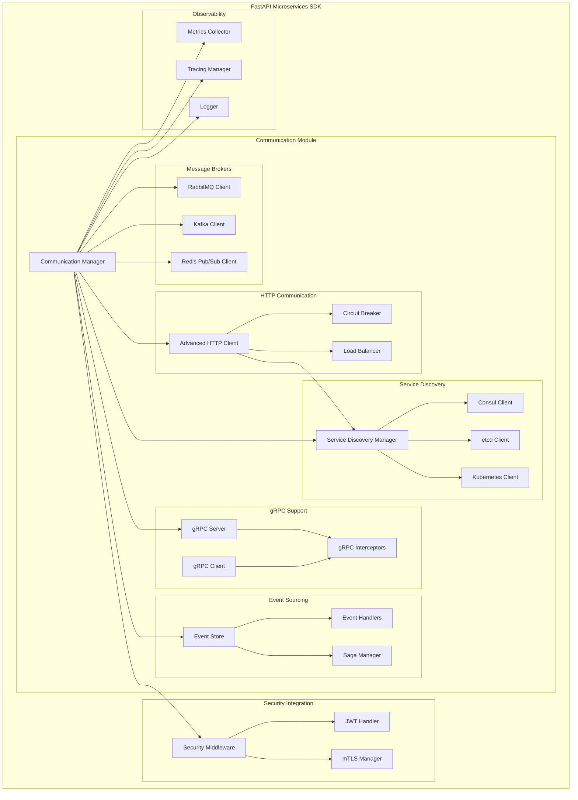

# Design Document - Sprint Communication

## Overview

El **Sprint Communication** implementa un sistema completo de comunicación entre microservicios que se integra perfectamente con el sistema de seguridad enterprise-grade ya existente. El diseño se basa en patrones probados de la industria y proporciona abstracciones de alto nivel que simplifican la implementación de arquitecturas distribuidas complejas.

### Key Design Principles

1. **Security First**: Integración nativa con mTLS, JWT, RBAC/ABAC del sistema de seguridad existente
2. **Reliability**: Circuit breakers, retry logic, dead letter queues, y graceful degradation
3. **Observability**: Distributed tracing, metrics, structured logging integrados desde el diseño
4. **Flexibility**: Soporte para múltiples protocolos y patrones de comunicación
5. **Performance**: Connection pooling, load balancing, y optimizaciones de throughput
6. **Developer Experience**: APIs intuitivas, configuración declarativa, y tooling completo

## Architecture

### High-Level Architecture



### Module Structure

```
fastapi_microservices_sdk/communication/
├── __init__.py                     # Communication exports
├── manager.py                      # CommunicationManager
├── config.py                       # Communication configuration
├── exceptions.py                   # Communication exceptions
│
├── messaging/                      # Message Brokers
│   ├── __init__.py
│   ├── base.py                     # Base message broker interface
│   ├── rabbitmq.py                 # RabbitMQ implementation
│   ├── kafka.py                    # Kafka implementation
│   ├── redis_pubsub.py             # Redis Pub/Sub implementation
│   ├── patterns.py                 # Messaging patterns (pub/sub, request/reply)
│   └── reliability.py              # Reliability patterns (DLQ, retry, ack)
│
├── http/                           # HTTP Communication
│   ├── __init__.py
│   ├── client.py                   # Advanced HTTP Client (enhanced)
│   ├── circuit_breaker.py          # Circuit breaker implementation
│   ├── load_balancer.py            # Load balancing strategies
│   ├── retry.py                    # Retry policies and backoff
│   └── middleware.py               # HTTP middleware integration
│
├── discovery/                      # Service Discovery
│   ├── __init__.py
│   ├── base.py                     # Service discovery interface
│   ├── consul.py                   # Consul integration
│   ├── etcd.py                     # etcd integration
│   ├── kubernetes.py               # Kubernetes service discovery
│   ├── registry.py                 # Enhanced service registry
│   └── health.py                   # Health check integration
│
├── grpc/                           # gRPC Support
│   ├── __init__.py
│   ├── server.py                   # gRPC server integration
│   ├── client.py                   # gRPC client with service discovery
│   ├── interceptors.py             # Security and observability interceptors
│   ├── codegen.py                  # Proto file code generation
│   └── streaming.py                # Streaming patterns and utilities
│
├── events/                         # Event Sourcing
│   ├── __init__.py
│   ├── base.py                     # Event base classes
│   ├── store.py                    # Event store implementation
│   ├── handlers.py                 # Event handler patterns
│   ├── saga.py                     # Saga pattern implementation
│   ├── cqrs.py                     # CQRS pattern support
│   └── consistency.py              # Eventual consistency utilities
│
├── middleware/                     # Communication Middleware
│   ├── __init__.py
│   ├── security.py                 # Security middleware integration
│   ├── observability.py            # Metrics and tracing middleware
│   ├── rate_limiting.py            # Rate limiting for communication
│   └── correlation.py              # Correlation ID propagation
│
└── testing/                        # Testing Utilities
    ├── __init__.py
    ├── mocks.py                    # Mock implementations
    ├── containers.py               # Test containers
    ├── fixtures.py                 # Test fixtures
    └── assertions.py               # Custom test assertions
```

## Components and Interfaces

### 1. Communication Manager

**Purpose**: Central orchestrator for all communication components

```python
class CommunicationManager:
    """Central manager for all communication components"""
    
    def __init__(self, config: CommunicationConfig):
        self.config = config
        self.message_brokers: Dict[str, MessageBroker] = {}
        self.http_clients: Dict[str, AdvancedHTTPClient] = {}
        self.service_discovery: ServiceDiscovery = None
        self.grpc_services: Dict[str, GRPCService] = {}
        self.event_store: EventStore = None
    
    async def initialize(self) -> None:
        """Initialize all communication components"""
    
    async def shutdown(self) -> None:
        """Graceful shutdown of all components"""
    
    def get_message_broker(self, name: str) -> MessageBroker:
        """Get configured message broker by name"""
    
    def get_http_client(self, service_name: str) -> AdvancedHTTPClient:
        """Get HTTP client for service communication"""
    
    def get_grpc_client(self, service_name: str) -> GRPCClient:
        """Get gRPC client for service communication"""
```

### 2. Message Brokers

**Base Interface**:
```python
class MessageBroker(ABC):
    """Abstract base class for message brokers"""
    
    @abstractmethod
    async def connect(self) -> None:
        """Establish connection to message broker"""
    
    @abstractmethod
    async def disconnect(self) -> None:
        """Close connection to message broker"""
    
    @abstractmethod
    async def publish(self, topic: str, message: Any, **kwargs) -> None:
        """Publish message to topic/queue"""
    
    @abstractmethod
    async def subscribe(self, topic: str, handler: Callable, **kwargs) -> None:
        """Subscribe to topic/queue with handler"""
    
    @abstractmethod
    async def health_check(self) -> bool:
        """Check broker health status"""
```

**RabbitMQ Implementation**:
```python
class RabbitMQClient(MessageBroker):
    """RabbitMQ client with advanced features"""
    
    def __init__(self, config: RabbitMQConfig):
        self.config = config
        self.connection: aio_pika.Connection = None
        self.channel: aio_pika.Channel = None
        self.exchanges: Dict[str, aio_pika.Exchange] = {}
        self.queues: Dict[str, aio_pika.Queue] = {}
    
    async def declare_exchange(self, name: str, type: str = "direct") -> aio_pika.Exchange:
        """Declare exchange with configuration"""
    
    async def declare_queue(self, name: str, durable: bool = True) -> aio_pika.Queue:
        """Declare queue with configuration"""
    
    async def setup_dead_letter_queue(self, queue_name: str) -> None:
        """Setup dead letter queue for failed messages"""
```

### 3. Advanced HTTP Client

**Enhanced HTTP Client**:
```python
class AdvancedHTTPClient:
    """HTTP client with circuit breaker, retry, and load balancing"""
    
    def __init__(self, 
                 service_name: str,
                 service_discovery: ServiceDiscovery,
                 circuit_breaker: CircuitBreaker,
                 retry_policy: RetryPolicy,
                 load_balancer: LoadBalancer):
        self.service_name = service_name
        self.service_discovery = service_discovery
        self.circuit_breaker = circuit_breaker
        self.retry_policy = retry_policy
        self.load_balancer = load_balancer
        self.session: httpx.AsyncClient = None
    
    async def request(self, method: str, path: str, **kwargs) -> httpx.Response:
        """Make HTTP request with all reliability patterns"""
    
    async def get_service_endpoint(self) -> str:
        """Resolve service endpoint from service discovery"""
    
    async def health_check(self) -> bool:
        """Check service health"""
```

**Circuit Breaker**:
```python
class CircuitBreaker:
    """Circuit breaker implementation for fault tolerance"""
    
    def __init__(self, 
                 failure_threshold: int = 5,
                 recovery_timeout: int = 60,
                 expected_exception: Type[Exception] = Exception):
        self.failure_threshold = failure_threshold
        self.recovery_timeout = recovery_timeout
        self.expected_exception = expected_exception
        self.failure_count = 0
        self.last_failure_time = None
        self.state = CircuitBreakerState.CLOSED
    
    async def call(self, func: Callable, *args, **kwargs) -> Any:
        """Execute function with circuit breaker protection"""
```

### 4. Service Discovery

**Service Discovery Manager**:
```python
class ServiceDiscoveryManager:
    """Manager for multiple service discovery backends"""
    
    def __init__(self, config: ServiceDiscoveryConfig):
        self.config = config
        self.backends: Dict[str, ServiceDiscoveryBackend] = {}
        self.cache: Dict[str, ServiceInstance] = {}
    
    async def register_service(self, service: ServiceInstance) -> None:
        """Register service in all configured backends"""
    
    async def discover_service(self, service_name: str) -> List[ServiceInstance]:
        """Discover service instances from backends"""
    
    async def health_check_service(self, service_name: str) -> Dict[str, bool]:
        """Check health of all service instances"""
```

### 5. gRPC Integration

**gRPC Server Integration**:
```python
class GRPCServerManager:
    """gRPC server with FastAPI integration"""
    
    def __init__(self, config: GRPCConfig):
        self.config = config
        self.server: grpc.aio.Server = None
        self.interceptors: List[grpc.aio.ServerInterceptor] = []
    
    def add_service(self, service_class: Any, implementation: Any) -> None:
        """Add gRPC service implementation"""
    
    def add_interceptor(self, interceptor: grpc.aio.ServerInterceptor) -> None:
        """Add gRPC interceptor"""
    
    async def start(self) -> None:
        """Start gRPC server"""
```

### 6. Event Sourcing

**Event Store**:
```python
class EventStore:
    """Event store for event sourcing patterns"""
    
    def __init__(self, config: EventStoreConfig):
        self.config = config
        self.storage_backend = None
        self.snapshots: Dict[str, Any] = {}
    
    async def append_event(self, stream_id: str, event: Event) -> None:
        """Append event to stream"""
    
    async def get_events(self, stream_id: str, from_version: int = 0) -> List[Event]:
        """Get events from stream"""
    
    async def create_snapshot(self, stream_id: str, aggregate: Any) -> None:
        """Create aggregate snapshot"""
```

## Data Models

### Configuration Models

```python
@dataclass
class CommunicationConfig:
    """Main communication configuration"""
    message_brokers: Dict[str, MessageBrokerConfig]
    http_clients: Dict[str, HTTPClientConfig]
    service_discovery: ServiceDiscoveryConfig
    grpc: GRPCConfig
    event_sourcing: EventSourcingConfig
    security_integration: bool = True
    observability_enabled: bool = True

@dataclass
class MessageBrokerConfig:
    """Message broker configuration"""
    type: str  # rabbitmq, kafka, redis
    connection_url: str
    connection_pool_size: int = 10
    retry_policy: RetryPolicyConfig
    dead_letter_queue: bool = True
    security: MessageBrokerSecurityConfig

@dataclass
class HTTPClientConfig:
    """HTTP client configuration"""
    timeout: TimeoutConfig
    retry_policy: RetryPolicyConfig
    circuit_breaker: CircuitBreakerConfig
    load_balancer: LoadBalancerConfig
    connection_pool_size: int = 100
```

### Event Models

```python
@dataclass
class Event:
    """Base event class"""
    event_id: str
    event_type: str
    aggregate_id: str
    aggregate_version: int
    event_data: Dict[str, Any]
    metadata: Dict[str, Any]
    timestamp: datetime
    correlation_id: str

@dataclass
class Command:
    """Base command class"""
    command_id: str
    command_type: str
    aggregate_id: str
    command_data: Dict[str, Any]
    metadata: Dict[str, Any]
    timestamp: datetime
    correlation_id: str
```

## Error Handling

### Exception Hierarchy

```python
class CommunicationError(Exception):
    """Base communication exception"""
    pass

class MessageBrokerError(CommunicationError):
    """Message broker related errors"""
    pass

class ServiceDiscoveryError(CommunicationError):
    """Service discovery related errors"""
    pass

class CircuitBreakerOpenError(CommunicationError):
    """Circuit breaker is open"""
    pass

class RetryExhaustedError(CommunicationError):
    """All retry attempts exhausted"""
    pass
```

### Error Recovery Strategies

1. **Exponential Backoff**: For transient failures
2. **Circuit Breaker**: For cascading failure prevention
3. **Dead Letter Queues**: For message processing failures
4. **Graceful Degradation**: Fallback to cached data or alternative services
5. **Health Check Integration**: Automatic service removal from load balancer

## Testing Strategy

### Unit Testing
- Mock implementations for all external dependencies
- Test doubles for message brokers and service discovery
- Isolated testing of circuit breakers and retry logic
- Configuration validation testing

### Integration Testing
- Test containers for RabbitMQ, Kafka, Redis
- Real service discovery backends (Consul, etcd)
- End-to-end communication flows
- Security integration testing

### Performance Testing
- Load testing for message throughput
- Latency testing for HTTP clients
- Circuit breaker behavior under load
- Memory usage and connection pooling

### Chaos Engineering
- Network partition simulation
- Service failure injection
- Message broker unavailability
- Partial system degradation scenarios

## Security Integration

### Authentication & Authorization
- Automatic JWT token propagation in HTTP requests
- mTLS certificate validation for gRPC
- Message broker authentication integration
- Service-to-service identity verification

### Encryption
- TLS encryption for all HTTP communication
- Message encryption for sensitive data
- gRPC channel security configuration
- Certificate rotation integration

### Audit & Monitoring
- Security event logging for all communications
- Failed authentication attempt tracking
- Suspicious communication pattern detection
- Integration with existing security monitoring

## Performance Considerations

### Connection Management
- Connection pooling for HTTP clients
- Persistent connections for message brokers
- Connection health monitoring
- Automatic connection recovery

### Caching Strategies
- Service discovery result caching
- HTTP response caching with TTL
- Event sourcing snapshot caching
- Configuration caching with invalidation

### Resource Optimization
- Async/await throughout for non-blocking I/O
- Efficient serialization (msgpack, protobuf)
- Memory-efficient event streaming
- CPU-optimized load balancing algorithms

## Monitoring and Observability

### Metrics Collection
- Request/response latency histograms
- Message throughput counters
- Circuit breaker state changes
- Service discovery resolution times
- Error rate by service and operation

### Distributed Tracing
- OpenTelemetry integration
- Correlation ID propagation
- Cross-service trace correlation
- Performance bottleneck identification

### Structured Logging
- JSON structured logs
- Correlation ID inclusion
- Security event logging
- Error context preservation

This design provides a comprehensive foundation for implementing robust, secure, and observable communication between microservices while integrating seamlessly with the existing security infrastructure.