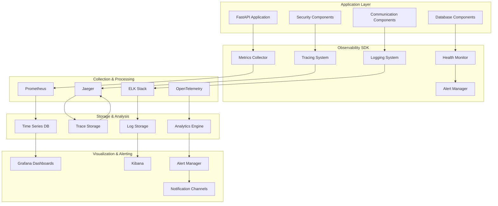
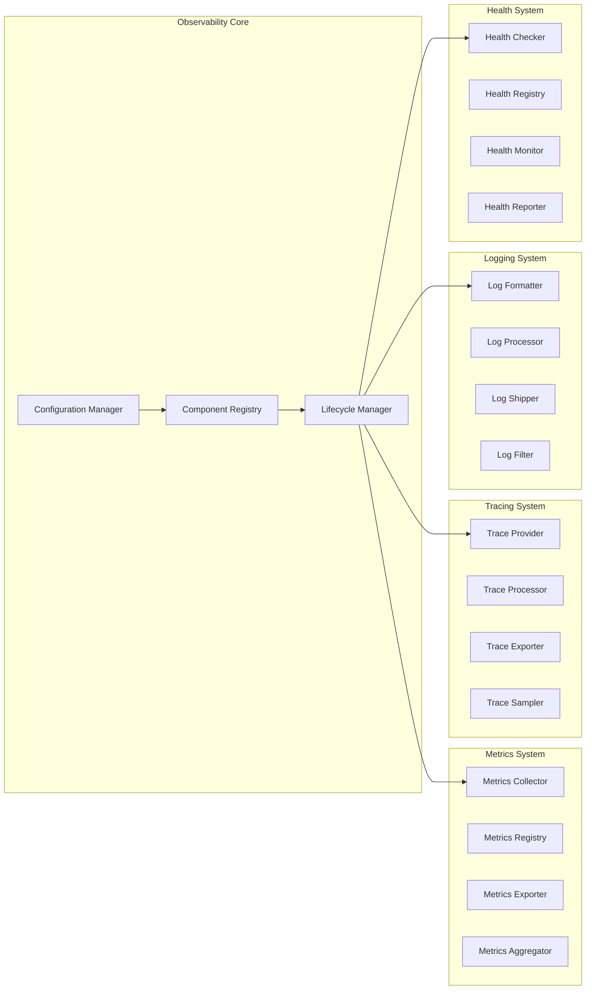

# Design Document - Sprint Observability

## Overview

The Observability Sprint implements a comprehensive, enterprise-grade observability stack for the FastAPI Microservices SDK. The design provides complete visibility into system behavior through metrics collection, distributed tracing, structured logging, health monitoring, and intelligent alerting. The architecture is built on industry-standard tools and protocols while maintaining high performance, scalability, and security.

The observability system integrates seamlessly with existing SDK components (Security, Communication, Database) and provides a unified view of system health and performance across all layers of the application stack.

## Architecture

### High-Level Architecture



### Component Architecture



## Components and Interfaces

### 1. Observability Manager

The central orchestrator that manages all observability components and provides a unified interface for configuration and control.

```python
class ObservabilityManager:
    """Central manager for all observability components."""
    
    async def initialize(self, config: ObservabilityConfig) -> None:
        """Initialize all observability components."""
        
    async def shutdown(self) -> None:
        """Gracefully shutdown all components."""
        
    def get_metrics_collector(self) -> MetricsCollector:
        """Get the metrics collection interface."""
        
    def get_tracer(self) -> Tracer:
        """Get the distributed tracing interface."""
        
    def get_logger(self) -> StructuredLogger:
        """Get the structured logging interface."""
        
    def get_health_monitor(self) -> HealthMonitor:
        """Get the health monitoring interface."""
```

### 2. Metrics Collection System

Comprehensive metrics collection with Prometheus integration and custom business metrics support.

```python
class MetricsCollector:
    """Collects and exports metrics in Prometheus format."""
    
    def counter(self, name: str, description: str, labels: Dict[str, str] = None) -> Counter:
        """Create a counter metric."""
        
    def gauge(self, name: str, description: str, labels: Dict[str, str] = None) -> Gauge:
        """Create a gauge metric."""
        
    def histogram(self, name: str, description: str, buckets: List[float] = None) -> Histogram:
        """Create a histogram metric."""
        
    def summary(self, name: str, description: str, quantiles: List[float] = None) -> Summary:
        """Create a summary metric."""
        
    async def collect_system_metrics(self) -> Dict[str, float]:
        """Collect system-level metrics (CPU, memory, etc.)."""
        
    async def export_metrics(self) -> str:
        """Export all metrics in Prometheus format."""
```

### 3. Distributed Tracing System

OpenTelemetry-based distributed tracing with Jaeger integration and intelligent sampling.

```python
class TracingSystem:
    """Manages distributed tracing across services."""
    
    def start_span(self, name: str, parent: Optional[Span] = None) -> Span:
        """Start a new trace span."""
        
    def inject_context(self, headers: Dict[str, str]) -> Dict[str, str]:
        """Inject trace context into headers."""
        
    def extract_context(self, headers: Dict[str, str]) -> Optional[SpanContext]:
        """Extract trace context from headers."""
        
    async def export_traces(self, spans: List[Span]) -> None:
        """Export completed spans to tracing backend."""
        
    def configure_sampling(self, strategy: SamplingStrategy) -> None:
        """Configure trace sampling strategy."""
```

### 4. Structured Logging System

Advanced logging with JSON formatting, correlation IDs, and ELK stack integration.

```python
class StructuredLogger:
    """Provides structured logging with correlation and context."""
    
    def info(self, message: str, **kwargs) -> None:
        """Log info level message with structured data."""
        
    def warning(self, message: str, **kwargs) -> None:
        """Log warning level message with structured data."""
        
    def error(self, message: str, exception: Optional[Exception] = None, **kwargs) -> None:
        """Log error level message with exception details."""
        
    def audit(self, event: str, user: str, resource: str, **kwargs) -> None:
        """Log audit event with required compliance fields."""
        
    def set_correlation_id(self, correlation_id: str) -> None:
        """Set correlation ID for request tracing."""
        
    async def ship_logs(self, destination: LogDestination) -> None:
        """Ship logs to configured destinations."""
```

### 5. Health Monitoring System

Comprehensive health checks with Kubernetes probe support and dependency monitoring.

```python
class HealthMonitor:
    """Monitors system and component health."""
    
    def register_check(self, name: str, check: HealthCheck) -> None:
        """Register a health check component."""
        
    async def check_health(self) -> HealthStatus:
        """Perform comprehensive health check."""
        
    async def check_readiness(self) -> ReadinessStatus:
        """Check if service is ready to accept traffic."""
        
    async def check_liveness(self) -> LivenessStatus:
        """Check if service is alive and functioning."""
        
    def add_dependency(self, name: str, dependency: DependencyCheck) -> None:
        """Add a dependency health check."""
        
    async def get_health_report(self) -> HealthReport:
        """Generate detailed health report."""
```

### 6. Alert Management System

Intelligent alerting with multiple notification channels and escalation policies.

```python
class AlertManager:
    """Manages alerts and notifications."""
    
    def define_alert(self, rule: AlertRule) -> None:
        """Define an alert rule with conditions and actions."""
        
    async def evaluate_alerts(self) -> List[Alert]:
        """Evaluate all alert rules against current metrics."""
        
    async def send_notification(self, alert: Alert, channels: List[NotificationChannel]) -> None:
        """Send alert notification through specified channels."""
        
    def configure_escalation(self, policy: EscalationPolicy) -> None:
        """Configure alert escalation policy."""
        
    async def suppress_alerts(self, pattern: str, duration: timedelta) -> None:
        """Suppress alerts matching pattern for specified duration."""
```

## Data Models

### Configuration Models

```python
@dataclass
class ObservabilityConfig:
    """Configuration for observability system."""
    enabled: bool = True
    metrics_config: MetricsConfig = field(default_factory=MetricsConfig)
    tracing_config: TracingConfig = field(default_factory=TracingConfig)
    logging_config: LoggingConfig = field(default_factory=LoggingConfig)
    health_config: HealthConfig = field(default_factory=HealthConfig)
    alert_config: AlertConfig = field(default_factory=AlertConfig)

@dataclass
class MetricsConfig:
    """Metrics collection configuration."""
    enabled: bool = True
    prometheus_endpoint: str = "/metrics"
    collection_interval: float = 15.0
    retention_days: int = 30
    high_cardinality_limit: int = 10000
    custom_labels: Dict[str, str] = field(default_factory=dict)

@dataclass
class TracingConfig:
    """Distributed tracing configuration."""
    enabled: bool = True
    jaeger_endpoint: str = "http://localhost:14268/api/traces"
    sampling_rate: float = 0.1
    max_spans_per_trace: int = 1000
    export_timeout: float = 30.0
    service_name: str = "fastapi-microservice"
```

### Metrics Models

```python
@dataclass
class MetricPoint:
    """Individual metric data point."""
    name: str
    value: float
    timestamp: datetime
    labels: Dict[str, str]
    metric_type: MetricType

@dataclass
class MetricSeries:
    """Time series of metric points."""
    name: str
    points: List[MetricPoint]
    metadata: Dict[str, Any]

class MetricType(Enum):
    """Types of metrics."""
    COUNTER = "counter"
    GAUGE = "gauge"
    HISTOGRAM = "histogram"
    SUMMARY = "summary"
```

### Tracing Models

```python
@dataclass
class Span:
    """Distributed trace span."""
    trace_id: str
    span_id: str
    parent_span_id: Optional[str]
    operation_name: str
    start_time: datetime
    end_time: Optional[datetime]
    tags: Dict[str, Any]
    logs: List[SpanLog]
    status: SpanStatus

@dataclass
class SpanLog:
    """Log entry within a span."""
    timestamp: datetime
    fields: Dict[str, Any]

class SpanStatus(Enum):
    """Span completion status."""
    OK = "ok"
    ERROR = "error"
    TIMEOUT = "timeout"
    CANCELLED = "cancelled"
```

### Health Models

```python
@dataclass
class HealthStatus:
    """Overall system health status."""
    status: HealthState
    checks: Dict[str, ComponentHealth]
    timestamp: datetime
    uptime: timedelta

@dataclass
class ComponentHealth:
    """Individual component health."""
    name: str
    status: HealthState
    message: str
    details: Dict[str, Any]
    last_check: datetime

class HealthState(Enum):
    """Health status states."""
    HEALTHY = "healthy"
    DEGRADED = "degraded"
    UNHEALTHY = "unhealthy"
    UNKNOWN = "unknown"
```

## Error Handling

### Exception Hierarchy

```python
class ObservabilityError(Exception):
    """Base exception for observability errors."""
    pass

class MetricsError(ObservabilityError):
    """Metrics collection or export errors."""
    pass

class TracingError(ObservabilityError):
    """Distributed tracing errors."""
    pass

class LoggingError(ObservabilityError):
    """Structured logging errors."""
    pass

class HealthCheckError(ObservabilityError):
    """Health monitoring errors."""
    pass

class AlertingError(ObservabilityError):
    """Alert management errors."""
    pass
```

### Error Handling Strategy

1. **Graceful Degradation**: Observability failures should not impact application functionality
2. **Circuit Breaker**: Protect against cascading failures in observability infrastructure
3. **Fallback Mechanisms**: Local storage and delayed export when backends are unavailable
4. **Error Metrics**: Track observability system health and errors
5. **Self-Healing**: Automatic recovery and retry mechanisms

## Testing Strategy

### Unit Testing
- Component isolation testing with mocks
- Configuration validation testing
- Error handling and edge case testing
- Performance impact measurement
- Memory leak detection

### Integration Testing
- End-to-end observability pipeline testing
- Backend integration testing (Prometheus, Jaeger, ELK)
- Cross-component correlation testing
- Load testing with realistic workloads
- Failure scenario testing

### Performance Testing
- Overhead measurement under various loads
- Scalability testing with high-cardinality metrics
- Memory usage profiling
- Network bandwidth impact assessment
- Storage growth rate analysis

### Security Testing
- Data encryption validation
- Access control testing
- Audit trail verification
- Sensitive data masking validation
- Compliance requirement verification

## Deployment Considerations

### Infrastructure Requirements
- Prometheus server for metrics storage
- Jaeger or compatible tracing backend
- Elasticsearch cluster for log storage
- Grafana for visualization
- Alert manager for notifications

### Kubernetes Integration
- ServiceMonitor for Prometheus discovery
- Jaeger operator for tracing infrastructure
- Fluentd/Fluent Bit for log collection
- Custom resource definitions for configuration
- Helm charts for easy deployment

### Cloud Platform Integration
- AWS CloudWatch integration
- Google Cloud Monitoring integration
- Azure Monitor integration
- Multi-cloud deployment support
- Vendor-agnostic configuration

### Security Considerations
- TLS encryption for all data in transit
- RBAC integration with Kubernetes
- Secret management for credentials
- Network policies for traffic isolation
- Audit logging for compliance

## Performance Optimization

### Metrics Optimization
- Efficient metric aggregation algorithms
- Cardinality limiting and sampling
- Batch export to reduce network overhead
- Memory-efficient storage structures
- Lazy evaluation of expensive metrics

### Tracing Optimization
- Intelligent sampling strategies
- Span batching and compression
- Asynchronous export pipelines
- Context propagation optimization
- Memory pool management for spans

### Logging Optimization
- Structured logging with minimal serialization overhead
- Asynchronous log processing
- Log level filtering at source
- Batch shipping to reduce I/O
- Compression for log transport

### Resource Management
- Memory usage monitoring and limits
- CPU usage optimization
- Network bandwidth management
- Storage cleanup and rotation
- Resource pooling for efficiency

This design provides a comprehensive, scalable, and maintainable observability solution that integrates seamlessly with the existing FastAPI Microservices SDK while providing enterprise-grade monitoring, tracing, and alerting capabilities.