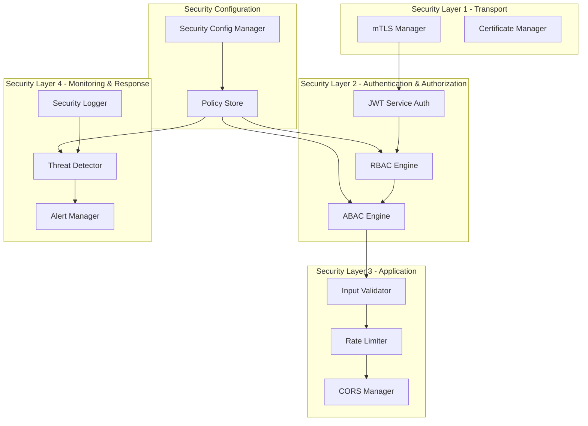
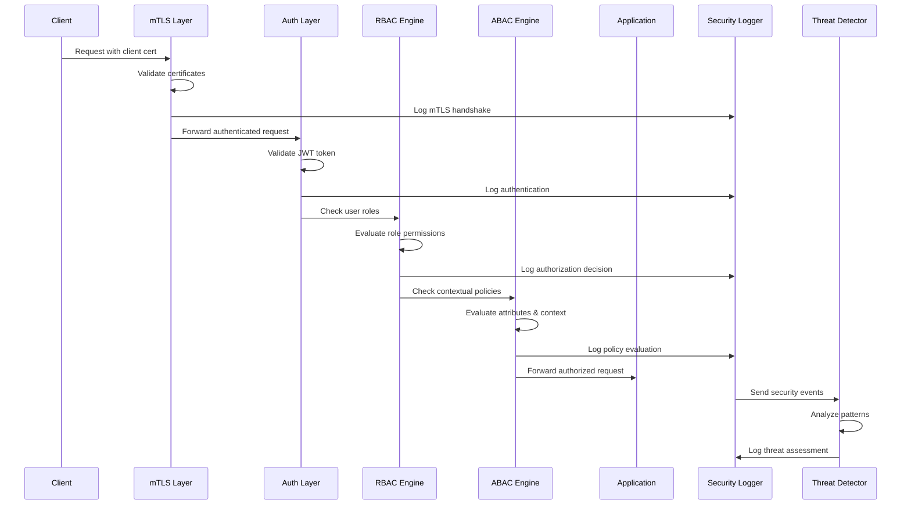

# Design Document - Sprint Security 2: Advanced Security

## Overview

This design document outlines the architecture and implementation approach for advanced security features in the FastAPI Microservices SDK. The design builds upon the existing security foundation (JWT, Secrets Management, Input Validation, Rate Limiting, CORS) to add enterprise-grade capabilities including mTLS, RBAC/ABAC, Security Logging, Certificate Management, and Threat Detection.

The design follows security-by-design principles, defense-in-depth strategy, and zero-trust architecture patterns to provide military-grade security suitable for highly regulated environments.

## Architecture

### High-Level Security Architecture



### Security Integration Flow



## Components and Interfaces

### 1. mTLS Manager

**Purpose**: Manages mutual TLS authentication for service-to-service communication.

**Key Classes**:
- `MTLSManager`: Main mTLS orchestrator
- `MTLSConfig`: Configuration for mTLS settings
- `CertificateValidator`: Validates certificate chains and revocation
- `MTLSMiddleware`: FastAPI middleware for mTLS enforcement

**Interface**:
```python
class MTLSManager:
    async def setup_mtls_context(self, cert_path: str, key_path: str, ca_path: str) -> SSLContext
    async def validate_peer_certificate(self, cert: Certificate) -> bool
    async def create_mtls_client(self, target_service: str) -> httpx.AsyncClient
    def create_mtls_middleware(self) -> MTLSMiddleware
```

### 2. RBAC Engine

**Purpose**: Implements role-based access control with hierarchical roles and permissions.

**Key Classes**:
- `RBACEngine`: Main RBAC orchestrator
- `Role`: Represents a role with permissions and hierarchy
- `Permission`: Represents a specific permission
- `RoleHierarchy`: Manages role inheritance
- `RBACMiddleware`: FastAPI middleware for RBAC enforcement

**Interface**:
```python
class RBACEngine:
    async def check_permission(self, user_roles: List[str], required_permission: str) -> bool
    async def get_user_roles(self, user_id: str) -> List[Role]
    async def assign_role(self, user_id: str, role_name: str) -> bool
    def create_rbac_dependency(self, required_permission: str) -> Callable
```

### 3. ABAC Engine

**Purpose**: Implements attribute-based access control with contextual policies.

**Key Classes**:
- `ABACEngine`: Main ABAC orchestrator
- `Policy`: Represents an ABAC policy with rules
- `AttributeProvider`: Provides user, resource, and environment attributes
- `PolicyEvaluator`: Evaluates policies against attributes
- `ABACMiddleware`: FastAPI middleware for ABAC enforcement

**Interface**:
```python
class ABACEngine:
    async def evaluate_policy(self, policy: Policy, context: ABACContext) -> PolicyDecision
    async def get_attributes(self, subject: str, resource: str, environment: dict) -> Attributes
    def create_abac_dependency(self, policy_name: str) -> Callable
    async def load_policies(self, policy_store: PolicyStore) -> None
```

### 4. Security Logger

**Purpose**: Provides structured security logging and auditing capabilities.

**Key Classes**:
- `SecurityLogger`: Main security logging orchestrator
- `SecurityEvent`: Represents a security event
- `LogFormatter`: Formats logs in structured format (JSON)
- `LogRotator`: Manages log rotation and retention
- `AuditTrail`: Maintains tamper-evident audit trail

**Interface**:
```python
class SecurityLogger:
    async def log_authentication(self, event: AuthEvent) -> None
    async def log_authorization(self, event: AuthzEvent) -> None
    async def log_security_violation(self, event: SecurityViolationEvent) -> None
    async def get_audit_trail(self, start_time: datetime, end_time: datetime) -> List[SecurityEvent]
```

### 5. Certificate Manager

**Purpose**: Manages X.509 certificates with automatic rotation and validation.

**Key Classes**:
- `CertificateManager`: Main certificate orchestrator
- `Certificate`: Represents an X.509 certificate
- `CertificateStore`: Secure storage for certificates
- `CertificateRotator`: Handles automatic certificate rotation
- `CAClient`: Communicates with Certificate Authority

**Interface**:
```python
class CertificateManager:
    async def load_certificate(self, cert_id: str) -> Certificate
    async def rotate_certificate(self, cert_id: str) -> Certificate
    async def validate_certificate_chain(self, cert: Certificate) -> bool
    async def check_revocation_status(self, cert: Certificate) -> bool
```

### 6. Threat Detector

**Purpose**: Detects security threats and anomalies in real-time.

**Key Classes**:
- `ThreatDetector`: Main threat detection orchestrator
- `ThreatRule`: Represents a threat detection rule
- `AnomalyDetector`: Detects statistical anomalies
- `AttackSignatureDetector`: Detects known attack patterns
- `ThreatResponse`: Handles threat response actions

**Interface**:
```python
class ThreatDetector:
    async def analyze_event(self, event: SecurityEvent) -> ThreatAssessment
    async def detect_brute_force(self, events: List[AuthEvent]) -> bool
    async def detect_anomaly(self, user_behavior: UserBehavior) -> AnomalyScore
    def register_threat_rule(self, rule: ThreatRule) -> None
```

## Data Models

### Security Event Models

```python
@dataclass
class SecurityEvent:
    event_id: str
    timestamp: datetime
    event_type: SecurityEventType
    severity: SecuritySeverity
    source_ip: str
    user_id: Optional[str]
    service_name: str
    correlation_id: str
    details: Dict[str, Any]

@dataclass
class AuthEvent(SecurityEvent):
    authentication_method: str
    success: bool
    failure_reason: Optional[str]
    user_agent: str

@dataclass
class AuthzEvent(SecurityEvent):
    resource: str
    action: str
    decision: PolicyDecision
    applied_policies: List[str]
    attributes_used: Dict[str, Any]
```

### RBAC Models

```python
@dataclass
class Role:
    name: str
    permissions: List[str]
    parent_roles: List[str]
    description: str
    created_at: datetime
    is_active: bool

@dataclass
class Permission:
    name: str
    resource: str
    action: str
    description: str
    scope: PermissionScope
```

### ABAC Models

```python
@dataclass
class Policy:
    name: str
    description: str
    rules: List[PolicyRule]
    effect: PolicyEffect  # ALLOW or DENY
    priority: int
    is_active: bool

@dataclass
class PolicyRule:
    condition: str  # Boolean expression
    attributes_required: List[str]
    
@dataclass
class ABACContext:
    subject_attributes: Dict[str, Any]
    resource_attributes: Dict[str, Any]
    environment_attributes: Dict[str, Any]
    action: str
```

### Certificate Models

```python
@dataclass
class Certificate:
    cert_id: str
    subject: str
    issuer: str
    serial_number: str
    not_before: datetime
    not_after: datetime
    public_key: bytes
    signature_algorithm: str
    extensions: Dict[str, Any]
    pem_data: str

@dataclass
class CertificateChain:
    leaf_cert: Certificate
    intermediate_certs: List[Certificate]
    root_cert: Certificate
    is_valid: bool
    validation_errors: List[str]
```

## Error Handling

### Security Exception Hierarchy

```python
class AdvancedSecurityError(SecurityError):
    """Base exception for advanced security features."""
    pass

class MTLSError(AdvancedSecurityError):
    """mTLS related errors."""
    pass

class CertificateError(AdvancedSecurityError):
    """Certificate management errors."""
    pass

class RBACError(AdvancedSecurityError):
    """RBAC related errors."""
    pass

class ABACError(AdvancedSecurityError):
    """ABAC related errors."""
    pass

class ThreatDetectionError(AdvancedSecurityError):
    """Threat detection errors."""
    pass

class SecurityLoggingError(AdvancedSecurityError):
    """Security logging errors."""
    pass
```

### Error Handling Strategy

1. **Fail Secure**: When security components fail, default to most restrictive policy
2. **Graceful Degradation**: Continue operation with reduced security if possible
3. **Comprehensive Logging**: Log all security errors for investigation
4. **Alert Generation**: Generate alerts for critical security failures
5. **Recovery Procedures**: Automatic recovery where possible, manual intervention for critical failures

## Testing Strategy

### Unit Testing

- **Component Isolation**: Test each security component independently
- **Mock Dependencies**: Mock external dependencies (CA, policy store, etc.)
- **Edge Cases**: Test boundary conditions and error scenarios
- **Performance**: Verify performance requirements are met

### Integration Testing

- **Component Interaction**: Test interaction between security components
- **End-to-End Flows**: Test complete security flows from request to response
- **Configuration Testing**: Test various security configurations
- **Failure Scenarios**: Test behavior during component failures

### Security Testing

- **Penetration Testing**: Test against common attack vectors
- **Certificate Validation**: Test certificate chain validation and revocation
- **Policy Bypass**: Attempt to bypass RBAC/ABAC policies
- **Threat Detection**: Test threat detection accuracy and response times

### Performance Testing

- **Latency Impact**: Measure security overhead on request latency
- **Throughput**: Test system throughput with security enabled
- **Scalability**: Test security components under load
- **Resource Usage**: Monitor CPU and memory usage of security components

## Security Considerations

### Defense in Depth

1. **Transport Security**: mTLS for all service communication
2. **Authentication**: JWT tokens with strong validation
3. **Authorization**: Multi-layered RBAC and ABAC
4. **Application Security**: Input validation and rate limiting
5. **Monitoring**: Comprehensive security logging and threat detection

### Zero Trust Principles

1. **Never Trust, Always Verify**: Validate every request at every layer
2. **Least Privilege**: Grant minimum necessary permissions
3. **Assume Breach**: Design for compromise scenarios
4. **Continuous Monitoring**: Real-time security monitoring and response

### Compliance Considerations

- **SOX**: Financial reporting controls and audit trails
- **HIPAA**: Healthcare data protection and access controls
- **PCI-DSS**: Payment card industry security standards
- **GDPR**: Data protection and privacy controls
- **NIST**: Cybersecurity framework alignment

## Implementation Phases

### Phase 1: Foundation (1 hour)
- Security configuration management
- Advanced exception handling
- Security logging infrastructure

### Phase 2: mTLS and Certificates (1.5 hours)
- Certificate management system
- mTLS implementation
- Certificate rotation automation

### Phase 3: Access Control (1.5 hours)
- RBAC engine implementation
- ABAC engine implementation
- Policy management system

### Phase 4: Monitoring and Response (1 hour)
- Threat detection system
- Security alerting
- Integration testing and validation

This design provides a comprehensive, secure, and scalable foundation for advanced security features while maintaining compatibility with existing security components.