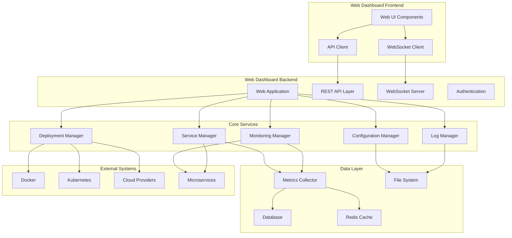

# Design Document

## Overview

The Advanced Web Dashboard for the FastAPI Microservices SDK will be a comprehensive web-based platform that extends the current basic web interface into a full-featured management and monitoring system. The design leverages existing observability components while introducing new web-specific modules for service management, real-time monitoring, and deployment orchestration.

The system will be built as a modular FastAPI application that integrates seamlessly with the existing SDK architecture, providing both REST APIs and WebSocket connections for real-time functionality. The frontend will use modern web technologies with server-side rendering for optimal performance and SEO.

## Architecture

### High-Level Architecture



### Technology Stack

- **Backend Framework**: FastAPI with async/await support
- **Frontend**: Jinja2 templates with Bootstrap 5 and Chart.js
- **Real-time Communication**: WebSockets for live updates
- **Database**: SQLite for development, PostgreSQL for production
- **Caching**: Redis for session management and real-time data
- **Monitoring**: Integration with existing observability components
- **Authentication**: JWT-based authentication with role-based access

## Components and Interfaces

### 1. Web Application Core (`fastapi_microservices_sdk/web/`)

#### Enhanced Web App (`app.py`)
```python
class AdvancedWebApp:
    def __init__(self):
        self.service_manager = ServiceManager()
        self.monitoring_manager = MonitoringManager()
        self.deployment_manager = DeploymentManager()
        self.config_manager = ConfigurationManager()
        self.log_manager = LogManager()
        self.auth_manager = AuthenticationManager()
        
    async def initialize(self):
        # Initialize all managers and start background tasks
        
    def setup_routes(self):
        # Setup all web routes and API endpoints
```

#### Service Management (`services/service_manager.py`)
```python
class ServiceManager:
    async def list_services(self) -> List[ServiceInfo]
    async def get_service_details(self, service_id: str) -> ServiceDetails
    async def start_service(self, service_id: str) -> bool
    async def stop_service(self, service_id: str) -> bool
    async def restart_service(self, service_id: str) -> bool
    async def delete_service(self, service_id: str) -> bool
    async def get_service_health(self, service_id: str) -> HealthStatus
```

#### Monitoring Manager (`monitoring/monitoring_manager.py`)
```python
class MonitoringManager:
    async def get_service_metrics(self, service_id: str, time_range: TimeRange) -> MetricsData
    async def get_system_metrics(self, time_range: TimeRange) -> SystemMetrics
    async def get_alerts(self, service_id: Optional[str] = None) -> List[Alert]
    async def create_alert_rule(self, rule: AlertRule) -> str
    async def get_dashboard_data(self, dashboard_id: str) -> DashboardData
```

### 2. Real-time Communication

#### WebSocket Manager (`websockets/websocket_manager.py`)
```python
class WebSocketManager:
    def __init__(self):
        self.connections: Dict[str, WebSocket] = {}
        self.subscriptions: Dict[str, Set[str]] = {}
    
    async def connect(self, websocket: WebSocket, client_id: str)
    async def disconnect(self, client_id: str)
    async def subscribe_to_service(self, client_id: str, service_id: str)
    async def broadcast_service_update(self, service_id: str, data: dict)
    async def send_metrics_update(self, client_id: str, metrics: dict)
```

#### Real-time Data Streams
- Service health status updates
- Live metrics streaming
- Log tail functionality
- Deployment progress updates
- Alert notifications

### 3. Frontend Components

#### Dashboard Templates (`templates/`)
- `dashboard/overview.html` - Main dashboard with service overview
- `dashboard/service_detail.html` - Individual service management
- `dashboard/monitoring.html` - Metrics and monitoring dashboard
- `dashboard/deployment.html` - Deployment management interface
- `dashboard/logs.html` - Log viewing and management
- `dashboard/configuration.html` - Service configuration editor

#### JavaScript Modules (`static/js/`)
- `dashboard.js` - Main dashboard functionality
- `websocket.js` - WebSocket connection management
- `charts.js` - Chart rendering and updates
- `service-manager.js` - Service management operations
- `deployment.js` - Deployment workflow management

### 4. API Layer

#### REST API Endpoints
```
GET    /api/services                    # List all services
GET    /api/services/{id}               # Get service details
POST   /api/services/{id}/start         # Start service
POST   /api/services/{id}/stop          # Stop service
POST   /api/services/{id}/restart       # Restart service
DELETE /api/services/{id}               # Delete service

GET    /api/metrics/services/{id}       # Get service metrics
GET    /api/metrics/system              # Get system metrics
GET    /api/alerts                      # Get alerts
POST   /api/alerts/rules                # Create alert rule

GET    /api/logs/services/{id}          # Get service logs
GET    /api/logs/services/{id}/stream   # Stream service logs

GET    /api/config/services/{id}        # Get service configuration
PUT    /api/config/services/{id}        # Update service configuration

POST   /api/deploy/services/{id}        # Deploy service
GET    /api/deploy/status/{deployment_id} # Get deployment status

GET    /api/templates                   # List templates
POST   /api/templates                   # Create custom template
PUT    /api/templates/{id}              # Update template
DELETE /api/templates/{id}              # Delete template
```

#### WebSocket Endpoints
```
/ws/dashboard                          # General dashboard updates
/ws/services/{id}                      # Service-specific updates
/ws/metrics                            # Real-time metrics stream
/ws/logs/{service_id}                  # Real-time log streaming
/ws/deployments/{deployment_id}        # Deployment progress updates
```

## Data Models

### Service Information
```python
@dataclass
class ServiceInfo:
    id: str
    name: str
    template_type: str
    status: ServiceStatus
    port: int
    created_at: datetime
    last_updated: datetime
    health_status: HealthStatus
    resource_usage: ResourceUsage
```

### Metrics Data
```python
@dataclass
class MetricsData:
    service_id: str
    timestamp: datetime
    cpu_usage: float
    memory_usage: float
    request_count: int
    response_time: float
    error_rate: float
```

### Deployment Configuration
```python
@dataclass
class DeploymentConfig:
    service_id: str
    target_environment: str
    deployment_type: DeploymentType
    configuration: Dict[str, Any]
    resources: ResourceRequirements
```

## Error Handling

### Error Response Format
```python
@dataclass
class ErrorResponse:
    error_code: str
    message: str
    details: Optional[Dict[str, Any]]
    timestamp: datetime
    request_id: str
```

### Error Categories
- **Validation Errors**: Invalid input parameters or configuration
- **Service Errors**: Service start/stop/restart failures
- **Deployment Errors**: Deployment failures with detailed logs
- **Authentication Errors**: Access denied or token validation failures
- **System Errors**: Internal server errors with proper logging

### Error Handling Strategy
- Graceful degradation for non-critical features
- Detailed error messages for debugging
- Automatic retry mechanisms for transient failures
- User-friendly error displays in the web interface
- Comprehensive error logging for troubleshooting

## Testing Strategy

### Unit Testing
- Individual component testing for all managers
- Mock external dependencies (Docker, Kubernetes, etc.)
- Test error handling and edge cases
- Validate data transformations and business logic

### Integration Testing
- End-to-end API testing with real services
- WebSocket connection and message handling
- Database operations and data persistence
- Template rendering and UI components

### Performance Testing
- Load testing for concurrent WebSocket connections
- Metrics collection and aggregation performance
- Database query optimization
- Frontend rendering performance with large datasets

### Security Testing
- Authentication and authorization testing
- Input validation and sanitization
- WebSocket security and rate limiting
- Configuration security and secret management

## Security Considerations

### Authentication & Authorization
- JWT-based authentication with refresh tokens
- Role-based access control (Admin, Developer, Viewer)
- Service-level permissions for fine-grained access
- Session management with secure cookies

### Data Protection
- Input validation and sanitization for all endpoints
- SQL injection prevention with parameterized queries
- XSS protection with proper template escaping
- CSRF protection for state-changing operations

### Network Security
- HTTPS enforcement for all web traffic
- WebSocket security with proper origin validation
- Rate limiting for API endpoints and WebSocket connections
- Secure headers (HSTS, CSP, etc.)

### Configuration Security
- Environment variable management for secrets
- Encrypted storage for sensitive configuration data
- Audit logging for configuration changes
- Secure defaults for all security-related settings

## Performance Optimization

### Caching Strategy
- Redis caching for frequently accessed data
- Browser caching for static assets
- Metrics data aggregation and caching
- Template caching for improved rendering performance

### Database Optimization
- Proper indexing for query performance
- Connection pooling for concurrent requests
- Query optimization and monitoring
- Data archival strategy for historical metrics

### Real-time Performance
- Efficient WebSocket message batching
- Metrics sampling and aggregation
- Background task optimization
- Memory usage monitoring and optimization

### Frontend Optimization
- Asset minification and compression
- Lazy loading for large datasets
- Progressive enhancement for better UX
- Responsive design for mobile compatibility